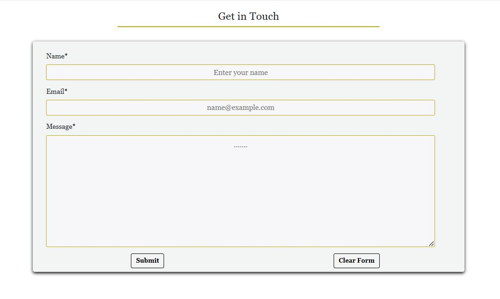

# Mindspark

**Mindspark** is an innovative e-commerce platform dedicated to providing thoughtfully curated products that enhance hands-on learning, productivity, and lifestyle. The project began with a focus on Montessori learning tools, aiming to support young minds with interactive, educational resources. As it grows, Mindspark is expanding its offerings to include a diverse range of tech gadgets, lifestyle accessories, and essential tools for all ages.

- **GitHub Profile**: <https://github.com/klsoundarya/mindspark>
- **Deployed Site**: <https://mind-spark-139c9f977593.herokuapp.com/>

- For Admin access with relevant sign-in information: [Mindspark Admin Access (https://mind-spark-139c9f977593.herokuapp.com/admin/)]

If you wish to make a test purchase, you can use the following [Stripe Dummy Card](https://stripe.com/docs/testing) details:

- **3D Secure Ireland Auth Number: 4000003720000005**
- **Exp Date: Any date in the future using the format MM/YY**
- **CVC: any 3 digit number**

Any payments made using a valid debit/credit card will not be processed and the card will not be charged. No orders made will be fulfilled.


,,,,,

<hr>

## Table of Contents

- [User Stories](#user-stories)
- [content challenge](#content-challenge)
  - [First Time User Goals](#first-time-user-goals)
  - [Returning Site Users](#returning-site-users)
  - [E-Commerce Buyer Goals](#e-commerce-buyer-goals)
  - [Blog Readers & Knowledge Seekers](#blog-readers-&-knowledge-seekers)
  - [Business Goals](#business-goals)
  - [Site Owner Goals](#site-owner-goals)
  - [Target Audience](#target-audience)
  - [Customer Goals](#customer-goals)
- [Wireframes](#wireframes)
  - [Mobile Wireframes](#mobile-wireframes)
  - [Laptop & Desktop Wireframes](#laptop--desktop-wireframes)
- [Deployment](#deployment)
  - [GitHub Pages](#github-pages)
  - [Django Project Setup](#django-project-setup)
  - [Cloudinary API](#cloudinary-api)
  - [PostgreSQL](#elephant-sql)
  - [Heroku deployment](#heroku-deployment)
  - [Forking](#forking)
  - [Making a Local Clone](#making-a-local-clone)
  - [Google Mail Setup](#google-mail-setup)
  - [Stripe Config](#stripe-config)
- [Features](#features)
  - [Existing Features](#existing-features)
  - [Features to Implement](#features-to-implement)
- [Testing](#testing)
- [Design](#design)
  - [UX](#ux)
  - [Typography](#typography)
  - [Gallery](#gallery)
  - [Color Scheme](#color-scheme)
- [Marketing](#marketing)
- [Project Planning](#project-planning)
  - [Strategy Plane](#strategy-plane)
  - [Agile Methodologies](#agile-methodologies)
    - [MoSCoW Prioritization](#moscow-prioritization)
    - [Sprints](#sprints)
  - [The Scope Plane](#the-scope-plane)
  - [The Structure Plane](#the-structure-plane)
  - [ERD and Models](#erd-and-models)
  - [The Skeleton Plane](#the-skeleton-plane)
  - [The Surface Plane](#the-surface-plane)
- [Credits](#credits)
  - [Tools & Technologies Used](#tools--technologies-used)
  - [Acknowledgments](#acknowledgements)
  - [Disclaimer](#disclaimer)


### User Stories

User stories and features recorded and managed on [GitHub Projects](<https://github.com/users/klsoundarya/projects/5>)

**Overview**

Mindspark is an innovative e-commerce platform offering Montessori learning tools, tech gadgets, and lifestyle accessories. The platform is designed to promote hands-on learning and innovation for users of all ages. Mindspark provides an engaging shopping experience with the following features:

1. Browse and explore products as a guest.
2. Register for an account to unlock additional features.
3. View, add, and edit items in the shopping cart.
4. Discover Montessori-inspired educational tools for children.
5. Shop for unique tech gadgets and lifestyle accessories.
6. Read blog articles on learning techniques, tech trends, and lifestyle tips.
7. Stay updated with the latest product highlights and promotions.
8. Mindspark is fully responsive, accessible on all browsers and devices, ensuring a seamless shopping experience for users.

### Content Challenge

1. **What do your users need?**
- Users need an easy-to-navigate platform that offers thoughtfully curated products like Montessori learning tools, educational toys, tech essentials, and lifestyle accessories. They are looking for products that support innovation, creativity, and hands-on learning for both children and adults.

2. **What information and features can you provide to meet those needs?**
- Product Descriptions & Details: Clear, concise, and informative product descriptions, images, and usage instructions.
- Search & Filter Options: To help users easily find what they're looking for (e.g., by category, age group, or price).
- Customer Reviews & Testimonials: To build trust and allow users to see feedback from others.
- Educational Content: Blog posts on topics related to Montessori learning and innovation.
- User Account Features: Allow customers to track their orders, save favorites, and manage their personal information.

3. **How can you make the information easy to understand?**
- By Using simple, straightforward language to explain product features and benefits.
- Utilize bullet points, images to break down complex information.
- Have a FAQ section to address common questions about the products and services.

4. **How can you demonstrate expertise, authoritativeness, and trustworthiness in your content?**
- By Including expert reviews or input from Montessori educators or specialists.
- Feature real customer testimonials and success stories to show the impact of your products.

5. **Would there be other pages within your own site you could link to from your chosen page?**
- Related Products: Linking to similar or complementary items on product detail pages (e.g., Montessori toys, learning kits).
- Blog Posts: Link blog posts that discuss Montessori methods, benefits of educational tech tools, or ways to encourage creativity in children.
- Testimonials Page: Link to a dedicated page showing all customer testimonials.

6. **Are there opportunities to link back to external websites that already rank highly on Google?**
- Link to authoritative Montessori organizations and educational institutions to support the credibility of your learning tools.

7. **How can you help users discover other relevant parts of your web application?**
- Add featured product sections or highlight new products that align with the users’ interests.
- Include call-to-action buttons to guide users to other sections of the website like the blog, shop categories, or featured collections.

**Content checklist**

- "I have implemented all the steps outlined in the checklist."


<!-- Some of the mentioned user stories have already been implemented, while the remaining ones from above content challenge are planned for future features. -->

<details>
<summary>User Goals</summary>
<br>

#### First time User Goals

- As a first-time user, I want to easily understand the purpose of Mindspark and how it supports hands-on learning, technology, and lifestyle improvement.
- As a first-time user, I want to browse product categories and see featured products to quickly find items that match my needs.
- As a first-time user, I want to read blog highlights to learn about educational tools, Montessori learning, and innovative gadgets.
- As a first-time user, I want the website to feel trustworthy and professional, with clear navigation and product descriptions.

#### Returning Site Users

- As a returning user, I want to explore new arrivals in Montessori learning tools, tech gadgets, and lifestyle products.
- As a returning user, I want to read fresh blog content that gives insights into learning methods, tech innovations, and practical tools.
- As a returning user, I want to check customer reviews and testimonials before making a purchase.
- As a returning user, I want a fast and simple checkout process for my orders.

#### E-Commerce Buyer Goals

- As a shopper, I want to search for specific products easily using filters and categories.
- As a shopper, I want to view detailed product descriptions with images to make informed purchasing decisions.
- As a shopper, I want to see secure payment options and track my order after purchasing.
- As a shopper, I want to read product recommendations based on my interests and past purchases.

#### Blog Readers & Knowledge Seekers

- As a blog reader, I want to access educational articles about Montessori learning, innovative tech, and lifestyle solutions.
- As a blog reader, I want to explore trending topics and see expert insights in hands-on education.
- As a blog reader, I want to share blogs on social media to spread valuable learning resources.

### Business Goals
Mindspark provides efficient admin functionality with an intuitive dashboard to manage:

- Product inventory for seamless additions and updates.
- Blog articles to keep customers engaged with insightful content.
- Order tracking and user management through the Django Admin Panel.
- Mindspark is designed to build a strong community of lifelong learners, tech enthusiasts, and parents looking for innovative educational tools. 

The platform's marketing efforts focus on:

- SEO-driven blog content to attract organic traffic.
- Social media promotions to engage with potential customers.
- Email newsletters to provide updates on new arrivals, trends, and exclusive offers

#### Site Owner Goals

- As the site owner, I want to showcase Mindspark’s vision and mission clearly on the homepage.
- As the site owner, I want to regularly update product listings to keep the inventory fresh and relevant.
- As the site owner, I want to ensure SEO optimization for better visibility and organic traffic growth.
- As the site owner, I want to engage with customers through blog content, testimonials, and social media.

### Target Audience

- Parents & Educators – Looking for Montessori tools to enhance learning for children.
- Young Professionals & Students – Searching for tech gadgets and lifestyle products to boost productivity.
- Innovative Learners & Thinkers – Interested in educational tools that encourage creativity and self-improvement.

### Customer Goals
Mindspark aims to provide a user-friendly shopping experience where customers can easily browse, learn about, and purchase innovative products. 
Customers are encouraged to:
- Find Montessori learning tools to support early education.
- Discover tech gadgets that enhance productivity and daily life.
- Stay informed through blog posts covering learning strategies, technology, and lifestyle trends.
- Register an account to manage purchases and receive exclusive updates.
- By offering high-quality educational and tech-based products, Mindspark empowers users to spark creativity and innovation in learning and everyday life.

</details>

### Wireframes

I have used [Canva](https://www.canva.com/) to design my website wireframes for mobile, laptop and desktop screen sizes to see and work on my website designing.

### Mobile Wireframes
<!-- learnt the dropdown from https://dev.to/asyraf/how-to-add-dropdown-in-markdown-o78 -->
<!-- My website has evolved from the initial wireframes I created earlier in the project. While the design now looks bit different from the original plan, I see this as a natural progression as the project developed. The changes reflect new ideas and insights that came up during the development process, resulting in a structure that aligns better with the project’s goals. -->

<details>
<summary>Mobile Wireframes</summary>
<br>


</details>

### Laptop & Desktop Wireframes

<details>
<summary>Laptop & Desktop Wireframes</summary>
<br>


</details>

## Deployment

<details>
<summary>To create the project from scratch, fork or clone use the following steps...</summary>
<br>

To begin this project from scratch, you must first create a new GitHub repository using the [Code Institute's Template](https://github.com/Code-Institute-Org/ci-full-template). This template provides the relevant tools to get you started. To use this template:

1. Log in to [GitHub](https://github.com/) or create a new account.
2. Navigate to the above CI Full Template.
3. Click '**Use this template**' -> '**Create a new repository**'.
4. Choose a new repository name and click '**Create repository from template**'.
5. In your new repository space, (choice of your IDE) click the button to generate a new workspace.

## Django Project Setup

1. Install Django and supporting libraries: 
   
- ```pip3 install 'django<4.2.16' gunicorn```
- ```pip3 install dj_database_url psycopg2```
- ```pip3 install dj3-cloudinary-storage```  
  
2. Once you have installed any relevant dependencies or libraries, such as the ones listed above, it is important to create a **requirements.txt** file and add all installed libraries to it with the ```pip3 freeze --local > requirements.txt``` command in the terminal.  
3. Create a new Django project in the terminal ```django-admin startproject mindspark .```
4. Create a new app example: ```python3 mangage.py startapp shop```
5. Add this to list of **INSTALLED_APPS** in **settings.py** - 'shop',
6. Create a superuser for the project to allow Admin access and enter credentials: ```python3 manage.py createsuperuser```
7. Migrate the changes with commands: ```python3 manage.py migrate```
8. An **env.py** file must be created to store all protected data such as the **DATABASE_URL**, **cloudinary** and **SECRET_KEY**. These may be called upon in your project's **settings.py** file along with your Database configurations. The **env.py** file must be added to your **gitignore** file so that your important, protected information is not pushed to public viewing on GitHub. For adding to **env.py**:

- ```import os```
- ```os.environ["DATABASE_URL"]="<copiedURLfromPostgreSQL>"```
- ```os.environ["SECRET_KEY"]="my_super^secret@key"```
  
For adding to **settings.py**:

- ```import os```
- ```import dj_database_url```
- ```if os.path.exists("env.py"):```
- ```import env```
- ```SECRET_KEY = os.environ.get('SECRET_KEY')``` (actual key hidden within env.py)  

9. Replace **DATABASES** with:

```
DATABASES = {
    'default': dj_database_url.parse(os.environ.get("DATABASE_URL"))
  }
```

10. Set up the templates directory in **settings.py**:
- Under ``BASE_DIR`` enter ``TEMPLATES_DIR = os.path.join(BASE_DIR, ‘templates’)``
- Update ``TEMPLATES = 'DIRS': [TEMPLATES_DIR]`` with:

```
os.path.join(BASE_DIR, 'templates'),
os.path.join(BASE_DIR, 'templates', 'allauth')
```

- Create the media, static and templates directories in top level of project file in IDE workspace.

11. A **Procfile** must be created within the project repo for Heroku deployment with the following placed within it: ```web: gunicorn mindspark.wsgi```
12. Make the necessary migrations again.

## Cloudinary API 

Cloudinary provides a cloud hosting solution for media storage. All users uploaded images in the mindspark project are hosted here.

Set up a new account at [Cloudinary](https://cloudinary.com/) and add your Cloudinary API environment variable to your **env.py** and Heroku Config Vars.
In your project workspace: 

- Add Cloudinary libraries to INSTALLED_APPS in settings.py 
- In the order: 
```
   'cloudinary_storage',  
   'django.contrib.staticfiles',  
   'cloudinary',
```
- Add to **env.py** and link up with **settings.py**: ```os.environ["CLOUDINARY_URL"]="cloudinary://...."``` 
- Set Cloudinary as storage for media and static files in settings.py:
- ```STATIC_URL = '/static/'```
```
  STATICFILES_STORAGE = 'cloudinary_storage.storage.StaticHashedCloudinaryStorage'  
  STATICFILES_DIRS = [os.path.join(BASE_DIR, 'static'), ]  
  STATIC_ROOT = os.path.join(BASE_DIR, 'staticfiles')‌  
  MEDIA_URL = '/media/'
  DEFAULT_FILE_STORAGE = 'cloudinary_storage.storage.MediaCloudinaryStorage'
```

## Deployment Process for PostgreSQL

To deploy **Mindspark** with PostgreSQL as the database, follow these steps:

A new database instance can be created from the [official website](https://www.postgresql.org/download/) for your project. 

#### 1. Configure PostgreSQL
   - Open the PostgreSQL command-line tool:
     ```bash
     sudo -u postgres psql
     ```
   - Create a new database:
     ```sql
     CREATE DATABASE mindspark_db;
     ```
   - Create a new user with a password:
     ```sql
     CREATE USER shop_admin WITH PASSWORD 'your_password';
     ```
   - Grant the user access to the database:
     ```sql
     ALTER ROLE shop_admin SET client_encoding TO 'utf8';
     ALTER ROLE shop_admin SET default_transaction_isolation TO 'read committed';
     ALTER ROLE shop_admin SET timezone TO 'UTC';
     GRANT ALL PRIVILEGES ON DATABASE mindspark_db TO shop_admin;
     ```
   - Exit the PostgreSQL prompt:
     ```sql
     \q
     ```

#### 2. Update Django Settings
   - In your Django project, go to `settings.py` and update the `DATABASES` setting:
     ```python
     DATABASES = {
         'default': {
             'ENGINE': 'django.db.backends.postgresql',
             'NAME': 'mindspark_db',
             'USER': 'mindspark_admin',
             'PASSWORD': 'your_password',
             'HOST': 'localhost',  # or IP address if using a remote server
             'PORT': '5432',       # default PostgreSQL port
         }
     }
     ```

#### 3. Apply Migrations
   - Run migrations to create the necessary tables in the PostgreSQL database:
     ```bash
     python manage.py migrate
     ```

#### 4. Verify the Setup
   - Start your Django server:
     ```bash
     python manage.py runserver
     ```
   - Visit your site to verify that the database is working as expected.

- From your user dashboard, retrieve the important 'postgres://....' value. Place the value within your **DATABASE_URL**  in your **env.py** file and follow the below instructions to place it in your Heroku Config Vars.

## Heroku Deployment

To start the deployment process , please follow the below steps:

1. Log in to [Heroku](https://id.heroku.com/login) or create an account if you are a new user.
2. Once logged in, in the Heroku Dashboard, navigate to the '**New**' button in the top, right corner, and select '**Create New App**'.
3. Enter an app name and choose your region. Click '**Create App**'.
4. In the Deploy tab, click on the '**Settings**', reach the '**Config Vars**' section and click on '**Reveal Config Vars**'. Here you will enter KEY:VALUE pairs for the app to run successfully. The KEY:VALUE pairs that you will need are your:

   - **DATABASE_URL**:**postgres://...**
   - **DISABLE_COLLECTSTATIC** of value '1' (N.B Remove this Config Var before deployment),
   - **SECRET_KEY** and value  
   - **AWS_ACCESS_KEY** and value
   - **AWS_SECRET_ACCESS_KEY** and value
   - **EMAIL_HOST_PASS** and value
   - **EMAIL_HOST_USER** and value
   - **STRIPE_PUBLIC_KEY** and value
   - **STRIPE_SECRET_KEY** and value
   - **STRIPE_WH_SECRET** and value
   - **USE_AWS** and value

5. Add the Heroku host name into **ALLOWED_HOSTS** in your projects **settings.py file** -> ```['herokuappname', ‘localhost’, ‘8000 port url’].```
2. Once you are sure that you have set up the required files including your requirements.txt and Procfile, you have ensured that **DEBUG=False**, save your project, add the files, commit for initial deployment and push the data to GitHub.
3. Go to the '**Deploy**' tab and choose GitHub as the Deployment method.
4. Search for the repository name, select the branch that you would like to build from, and connect it via the '**Connect**' button.
5. Choose from '**Automatic**' or '**Manual**' deployment options, I chose the 'Manual' deployment method. Click '**Deploy Branch**'.
6.  Once the waiting period for the app to build has finished, click the '**View**' link to bring you to your newly deployed site. If you receive any errors, Heroku will display a reason in the app build log for you to investigate. **DISABLE_COLLECTSTATIC**  may be removed from the Config Vars once you have saved and pushed an image within your project.

#### Forking

By forking the GitHub Repository, we make a copy of the original repository on our GitHub account to view and/or make changes without affecting the original owner's repository.

You can fork this repository by using the following steps:

1. Log in to GitHub and locate the [mindspark repository](https://github.com/klsoundarya/mindspark)
2. At the top of the Repository (not top of page) just above the "Settings" Button on the menu, locate the "Fork" Button.
3. Once clicked, you should now have a copy of the original repository in your own GitHub account!

### Making a Local Clone

1. Log in to GitHub and locate the [mindspark repository](https://github.com/klsoundarya/mindspark)
2. Find the Code button situated above the file list and give it a click.
3. Choose your preferred cloning method — whether it's HTTPS, SSH, or GitHub and hit the copy button to copy the URL to your clipboard.
4. Launch Git Bash or Terminal.
5. Navigate to the directory where you want the cloned directory to reside.
6. In your IDE Terminal, input the following command to clone the repository:

> git clone <https://github.com/klsoundarya/mindspark>

__Press Enter and your local clone will be created.__

7. Using the ``pip3 install -r requirements.txt`` command, the dependencies and libraries needed for **Mindspark** will be installed.
8. Set up your **env.py** file and from the above steps for Cloudinary and PostgreSQL, gather the Cloudinary API key and the PostgreSQL url for additon to your code.
9. Ensure that your **env.py** file is placed in your **.gitignore** file and follow the remaining steps in the above Django Project Setup section before pushing your code to GitHub.

## Google Mail Setup

1. Create a Gmail Account to manage emails for your Mindspark project.
2. Enable 2-Step Verification:
  - Go to **Settings** -> **Other Google Account Settings** -> **Accounts** -> **Import** -> **Other Account Settings**.
  - Activate 2-Step Verification for enhanced security.
3. Generate an App Password:
  - Navigate to **App Passwords** under Security Settings.
  - Select **Other** and enter a name (e.g., "Mindspark").
4. Click **Create** and copy the 16-digit app password provided.
5. Configure Django Email Settings in `settings.py`:
  - Add the EMAIL_HOST_USER (your Gmail address).
  - Add the EMAIL_HOST_PASS (the generated app password).
6. Update Heroku Config Vars:
  - Add EMAIL_HOST_USER and EMAIL_HOST_PASS to your Heroku environment variables.

## Stripe Config

Mindspark uses Stripe API for secure payment processing. Follow these steps to set up Stripe:

1. Create a Stripe Account and log in to the Stripe Dashboard.
2. Obtain Test API Keys:
  - In the Stripe Dashboard, navigate to **Developers → API Keys**.
  - Copy your `STRIPE_PUBLIC_KEY` and `STRIPE_SECRET_KEY`.
3. Update Environment Variables:
  - Store STRIPE_PUBLIC_KEY and STRIPE_SECRET_KEY in env.py.
  - Connect them in `settings.py` using environment variables.
4. Add these keys to your Heroku Config Vars.
5. Set Up Webhooks for Payment Security:
  - In Stripe Dashboard, go to **Developers** → **Webhooks**.
  - Click **Add Endpoint** and enter: https://your-heroku-app-url/checkout/wh.
6. Select **Retrieve all events** and **save the endpoint**.
7. Secure Webhooks:
  - Generate a **STRIPE_WH_SECRET** key.
  - Add it to env.py, settings.py, and Heroku Config Vars as before.


</details>


## Features

<details>
<summary>Project Features</summary>
<br>

### Existing Features

**Home Page:**

- Displays a welcoming layout with carousel about images showcasing the website features, and essential navigation links.
- Offers quick access to the most popular or recently updated blog posts.
- Allows users to leave a review, it has options of edit and delete for the respective users.

**Blog Page:**

- Displays a list of blog articles related to Montessori learning tools, gadgets, and lifestyle accessories.
- Includes article images, titles, publication dates, and short excerpts.
- Provides a "Read More" button to access full articles.
- Enables filtering by category or keyword search for easy navigation.

**Shop Page:**

- Displays all available products categorized for easy browsing.
- Allows users to filter products by price, category, and popularity.
- Includes pagination to enhance user experience.

**Product-detail Posts:**

- Displays detailed information about a selected product, including title, description, price, and images.
- Shows available stock and an option to add the product to the cart or wishlist.
- Provides customer reviews and ratings for transparency.
- Displays related product recommendations.

**Contact Page:**

- Contains a contact form for users to reach out to the website administrators.
- Displays relevant contact information, including email and social media links.

**Newsletter subscription:**

- Users can subscribe to the newsletter by entering their email in the designated field on the website.  
- The subscription details, includes user's email in the audience section, where the info is securely stored in the **Mailchimp dashboard**, allowing for easy management and communication.


**Password Update:**

- Users can update their password via a secure form.
- Ensures password strength guidelines are followed (e.g., minimum length, no common passwords).
- Provides a confirmation message upon successful password update.

**My profile:**

- Displays user information, including name, email, and order history.
- Allows users to update their personal details.
- Provides easy navigation to wishlist, cart, and order history.


**Add a product:**
(For Admin or Authorized Users)

- Allows authorized users to add new products with images, descriptions, and pricing.
- Enables category selection and inventory management.
- Provides an intuitive interface for quick product additions.

**Wishlist:**

- Enables users to save favorite products for later purchase.
- Provides an option to move wishlist items to the cart directly.
- Displays product availability and price updates.

**Cart:**

- Displays all selected products with their prices, quantities, and total cost.
- Allows users to update product quantities or remove items.
- Provides a "Proceed to Checkout" button for payment.

**Checkout:**

- Allows users to enter shipping and billing details.
- Provides multiple payment options (Stripe integration).
- Displays order summary before final confirmation.
- Includes secure transaction processing.

**Thank you checkout**

- Displays order confirmation and estimated delivery time.
- Provides an order reference number for tracking.
- Encourages users to continue shopping or explore the home.

**Delete Account:**

- Allows users to delete their account from mindspark.

**Login:**

- Authenticated users can log in to access personalized features like updating profile delivery information, saving the user profile details.
- Supports username/email and password-based authentication.

**Logout:**

- Logged-in users can log out to end their session and return to the public view of login site.

**AllAuth**  

Django AllAuth is a versatile framework designed to handle user registration, login, email verification, password forgot and authentication seamlessly. It ensures secure access control by managing registered and unregistered users, determining what content is accessible on the "Mindspark" website.

The setup process for AllAuth included the following steps:

- Installing the package as a project dependency.
- Adding it to the INSTALLED_APPS section in settings.py.
- Configuring the AUTHENTICATION_BACKENDS as recommended in the AllAuth documentation.
- Including AllAuth URLs in the project's urls.py file for routing.
- Running database migrations to create the required authentication-related tables.

**CSRF Tokens** 

CSRF (Cross-Site Request Forgery) tokens are security features included in every form on the site. These tokens help ensure that form submissions are authenticated and come from legitimate users. Without CSRF tokens, the website could be vulnerable to malicious attacks where unauthorized users might attempt to steal sensitive user data or perform actions without permission.

- When links are broken users can see the custom error code for 400, 403, 404, 500 pages.

There are media query breakpoints. This convenient feature allows users to easily access different sections of the website, making the browsing experience smoother and more efficient.

- Changed the icon of the contact, so it varies in the features image.

| Features        	| Desktop                                            	| Phone                                            	|
|-----------------	|----------------------------------------------------	|--------------------------------------------------	|
| Top Header       || |
| Nav            	  |            	|            	|
| Footer          	|      	|      	|
| Alert          	|      	|      	|
| Home            	|             	|             	|
| Blog           	|            	|            	|
| Shop          	|           	|           	|
| Product-detail          	|           	|           	|
| Shop-Footer   	|    	|    	|
| Contact         	|          	|          	|
| Log In          	|            	|            	|
| Log Out         	|           	|           	|
| Sign Up         	|          	|          	|
| FAQ        	|          	|          	|
| Update Password 	|  	|  	|
| Delete Account 	|  	|  	|
| My Profile  	|  	|  	|
| Add a Product 	|  	|  	|
| Wishlist 	|  	|  	|
| Cart 	|  	|  	|
| Checkout 	|  	|  	|
| Thank You 	|  	|  	|


## Features to Implement

While the Mindspark project includes core functionalities, future improvements and enhancements will further refine the user experience and expand its capabilities. Below are planned features to be implemented:

**AI-Powered Product Recommendations:**

- Implement an AI-based recommendation system that suggests products based on user browsing history, wishlist, and purchase behavior.
- Display "You May Also Like" and "Frequently Bought Together" sections on product pages.

**User Reviews & Ratings System**

- Allow users to leave product reviews and ratings.
- Implement a review approval system for moderation before publishing.
- Display average product ratings on shop and product detail pages.

**Blog Enhancement**

- Enable comments and discussions on blog posts.
- Implement a "Related Articles" section to encourage further reading.
- Allow users to bookmark or share articles on social media.

**Social Media Integration**

- Enable social media logins (Google, Facebook) for seamless account creation.
- Implement share buttons on product and blog pages for social engagement.
- Auto-post new product launches and blog updates to linked social media accounts.

**Wishlist Improvements**

- Enable users to categorize and save multiple wishlists (e.g., "For Kids," "Tech Gadgets").
- Provide an option to share wishlists with friends and family.

**Subscription & Newsletter Integration**

- Allow users to subscribe to newsletters for updates on new products and special deals.
- Implement automated email campaigns for abandoned carts and personalized offers.

</details>

## Testing
- For all testing, please refer to the [TESTING.md](TESTING.md) file.

### Design

<details>
<summary>Design Overview</summary>
<br>

## UX

### Five Planes of User Experience

The five planes are like layers that designers think about when making things for people to use. It starts with big ideas and end with the actual look and feel of what users interact with.


#### Typography

Mindspark incorporates a mix of playful yet professional typefaces to enhance readability and engagement. The primary fonts used are:

- Emilys Candy (Serif) – Adds a creative and fun touch, making learning tools visually appealing.
- Arial (Sans-serif) – Ensures a clean and modern look, improving readability across devices.
- Fondamento (Serif) – Provides an elegant, handwritten feel, reinforcing the Montessori-inspired theme.
- Kavoon, Merriweather, Lucida Sans Regular, Verdana (Sans-serif & Serif mix) – Offers versatility and a balance between decorative and readable text.
- Font Awesome 6 Free – Used for icons and UI elements to enhance navigation and user experience.

#### Gallery

- All app design, wireframes, favicon, structured images for readme are sourced  from [Canva](https://www.canva.com/).

#### Color Scheme

- #ffe552 (Bright Yellow) – Highlights important elements and call-to-action buttons, creating an engaging experience.
- #001d5a (Deep Blue) – Used for text and accents, adding depth and contrast.
- #bfa616 (Golden Hue) – Adds a touch of elegance, often used in branding elements.
- #f3f5f5 (Soft Grayish White) – Provides a neutral, clean background for content sections.
- #666 (Muted Gray) – Used for secondary text to maintain readability without overpowering key content.
- #28a745 (Green) & #ffc107 (Amber) – Utilized for success and warning messages, making alerts clear and intuitive.
- #000000ec (Dark Black) – Enhances contrast for footers and overlays, ensuring accessibility.
- #dc3545 (Vibrant Red) – Used sparingly for error messages and urgent notifications.
- #f7f7f8 (Light Gray) – Maintains a soft, minimalist aesthetic for backgrounds.
- #777 (Neutral Gray) – Provides subtle contrast for body text and UI components.


</details>

## Marketing

<details>
<summary>Social Media Marketing Overview</summary>
<br>

A dedicated [Mindspark Facebook Page] (https://www.facebook.com/profile.php?id=61569773265756) and [Instagram account](https://www.instagram.com/mind.spark2/) have been created to enhance brand visibility, engage with the target audience, and drive traffic to the Mindspark e-commerce platform. These social media platforms serve as primary channels for promoting Montessori learning tools, tech gadgets, and lifestyle accessories.

**Facebook & Instagram Strategy**
- Regular posts on both platforms will focus on:

  - Showcasing new and featured products.
  - Sharing informative content about Montessori learning and tech innovations.
  - Announcing exclusive deals, discounts, and limited-time offers.
  - Posting user testimonials and customer stories to build trust.
  - Engaging with followers through interactive content such as polls, quizzes, and live Q&A sessions.
  - Running paid ad campaigns and utilizing Facebook’s ‘Boost’ feature to extend reach to potential customers.
  - By maintaining an active presence on both Facebook and Instagram, Mindspark aims to create a strong community of parents, educators, and tech enthusiasts who are   - passionate about hands-on learning and innovation.

**SEO & Keyword Optimization**
Mindspark incorporates researched keywords into social media content, website meta tags, and product descriptions to improve search engine ranking. These keywords include:

- Montessori learning tools
- STEM educational toys
- Hands-on learning products
- Innovative tech gadgets
- Montessori toys for kids
- Educational tools for all ages
- Creative learning resources
- STEM kits for children
- Shop Montessori essentials
- Buy interactive learning gadgets
- Search Engine Optimization (SEO) Features

To further optimize online visibility, Mindspark includes:

 - Meta tags & descriptions in the website’s <head> section, using relevant keywords to improve search engine indexing.
 - sitemap.xml & robots.txt files to guide search engines on crawling site content effectively, enhancing SEO ranking.
 - Alt text on images to improve accessibility and searchability of product images.
 - By leveraging social media marketing and SEO strategies, Mindspark aims to establish itself as a trusted brand for innovative learning tools and gadgets, reaching a wider audience and increasing customer engagement.

*Mindspark Facebook Business Page*


*Mindspark Instagram Page*


</details>

### Project Planning 

<details>
<summary>Stages of Planning</summary>
<br>

## Strategy Plane

The "Mindspark" website is an innovative e-commerce platform dedicated to providing thoughtfully curated products that enhance hands-on learning, productivity, and lifestyle. The project began with a focus on Montessori learning tools, aiming to support young minds with interactive, educational resources.

## Agile Methodologies

The development of the "Mindspark" website followed Agile methodologies, focusing on iterative progress and continuous feedback. I used my [Github Projects Board](https://github.com/users/klsoundarya/projects/5) to plan and document all of my work.

### MoSCoW Prioritization

For the development of **Mindspark**, I applied the **MoSCoW Prioritization Method** to efficiently manage features and ensure that key elements were delivered on time:

**Must Haves:** These are the essential features needed to launch the MVP. They include:

- User registration and authentication system.
- Home page with Latest Blog Highlights, about us with Shop Now button.
- A product catalog with shopping cart functionality.
- The ability for users to add products to their cart and checkout.
- An e-commerce page showcasing the products, sorting features, related products.
- Integration with payment systems like Stripe.

**Should Haves:** These features are important but not essential for the initial release:

- Product reviews and ratings.
- Product search and filter functionality.
- User profile management and order history.

**Could Haves:** Features that add extra value but are not necessary for the MVP:

- Email notifications for order confirmation and shipping updates.
- User wishlist functionality.
- Interactive educational content related to Montessori tools.

**Won’t Haves:** Features excluded or deprioritized for this release:

- Multi-language support.
- Advanced recommendation system.

This prioritization helped keep the project focused on key features while leaving room for future enhancements.

### Sprints

The project was broken down into sprints to help structure development and ensure timely delivery of core features. Each sprint is planned from the project starting in December and a deadline of March 3rd for submission.

**Sprint 1:**

- Set up the project environment and database.
- Developed models for products, categories, and users.
- Implemented basic user authentication (login, signup, logout).
- Created Home page with featured products and categories.

**Retrospection:** The sprint went well, but it took a bit longer than expected to implement the user authentication system.

**Sprint 2:**

- Built out the product catalog page.
- Implemented basic shopping cart functionality.
- Started integration with Stripe payment system.
- Designed a responsive layout using Bootstrap.

**Retrospection:** The cart system worked smoothly, but we realized a few UI tweaks were needed for a more intuitive experience.

**Sprint 3:**

- Finalized product pages and checkout process.
- Added product details pages with images and descriptions.
- Integrated Stripe for payment processing.
- Implemented product search and filters.

**Retrospection:** There were some bugs in the Stripe integration, but they were resolved by adjusting payment handling.

**Sprint 4:**

- Developed user profile management (view/edit profile, order history).
- Added functionality for users to view past orders.
- Integrated product reviews and ratings.
- Added newsletter subscription feature.

**Retrospection:** This sprint was productive; however, some UI aspects still need refining.

**Sprint 5:**

- Enhanced checkout page with shipping details.
- Refined product filtering and sorting system.
- Completed Stripe and checkout testing for bugs.
- Worked on product recommendations based on user preferences.

**Retrospection:** Integration and testing went smoothly, but some more optimizations are needed for product recommendations.

**Sprint 6:**

- Added wishlist functionality for logged-in users.
- Created educational content for product page (Montessori tools).
- Refined the order confirmation and email notifications.

**Retrospection:** The wishlist feature is a nice-to-have but could be improved with better UI.

**Sprint 7:**

- Finalized order history page for users.
- Completed all Stripe testing and deployed to production.
- Completed database schema optimization.

**Retrospection:** Some minor fixes were needed after testing, but overall everything is working well.

**Sprint 8:**

- Refined user interface across all pages.
- Focused on adding missing features and bug fixes.
- Implemented final design adjustments.
- Start preparing for deployment.

**Retrospection:** The sprint was smooth, and now the site is nearly complete with final touches before submission.

#### The Scope Plane

The website will include core features such as:

- Product catalog with product details, images, and descriptions.
- User authentication system (registration, login, logout).
- Shopping cart and checkout with Stripe payment integration.
- User profile and order history.
- Wishlist and product reviews.
- Educational content on Montessori principles and tools.

Future plans include adding additional features like multi-language support, and a mobile app.
  
#### The Structure Plane

The website is structured with a clear navigation system, featuring dedicated pages for Home, Blog, Shop, Contact, Search bar, Wishlist, Cart and user account management (Product Management, Login, Logout, Signup, Delete Account, Profile settings, Password Update, FAQs), ensuring a seamless user experience.

#### ERD and Models:

For Entity Relationship Diagram (ERD), below is an overview of the models that i used:

**Blog:** Represents article information (title, content, published, created_at, updated_at, image).
**Shop:** Stores product details, order, category (name,  friendly_name, description, price, delivery, reviews_count, discount, in_stock, image, category, age_group, sku, rating).
**Wishlist:** Stores products users have saved (user, product, added_at).
**Testimonials:** Stores user reviews (user, message, rating, created_at).
**Profiles**: Represents FAQs  ( question, answer, is_active, created_at, updated_at), 
stores deleted user details ( username, email, deleted_at) and 
User delivery information (user, default_phone_number, default_street_address1, default_street_address2, default_town_or_city, default_county, default_postcode, default_country).
**Contact Us:** Represents user contact messages (name, email, message, created_at, read).
**Checkout:** Stores items data and user delivery information (
 order_number, full_name, user_profile, email, phone_number, country, postcode, town_or_city, street_address1, street_address2, county, date, delivery_cost, order_total, grand_total, original_cart, stripe_pid, order, product, quantity, lineitem_total).


#### The Skeleton Plane

Please refer to the [Wireframes](#wireframes) section.

#### The Surface Plane

[View the live site here.](https://mind-spark-139c9f977593.herokuapp.com/)

</details>

### Credits

<details>
<summary>Technologies</summary>
<br>

### Tools & Technologies Used

The following technologies were used in this overall project.

- My project is inspired from [code institute](https://learn.codeinstitute.net/) Boutique Ado walkthrough project .
- I used [Canva](https://www.canva.com/) to create the color scheme, readme images collage, favicon image, wireframes.
- Additionally, I used [freepik](https://www.freepik.com/), [remove bg](https://www.remove.bg/), [templates hub](https://www.templateshub.net/templates/e-commerce), [app.leonardo.ai](https://leonardo.ai/), [imagekit.io](https://imagekit.io/), [contrast checker](https://coolors.co/contrast-checker) for images and website.
- [ChatGPT](https://chat.openai.com/), [Grammarly](https://app.grammarly.com/) and a [plagiarism checker](https://www.duplichecker.com/) is used to review the text, code and ensure there were no grammar or spelling mistakes.
- I used [Am I Responsive](https://ui.dev/amiresponsive) design to show my webiste in various screen sizes.
- [CI Python Linter](https://pep8ci.herokuapp.com/) is been used to check for the bugs
- I referred to resources such as [stack overflow](https://stackoverflow.com/), [W3Schools](https://www.w3schools.com/css/default.asp) for assistance in understanding code in few places and finding answers to questions relevant to my coding.
- [Django Docs](https://www.djangoproject.com/) used as the resources.
- [Visual Studio Code](https://code.visualstudio.com/) used as a remote code editor.
- [GitHub](https://github.com) used for secure online code storage.
- [Heroku](https://www.heroku.com/) used for hosting the deployed back-end site.
- [Git](https://git-scm.com/) was used for version control by utilizing the command line terminal in VS code to commit and Push to GitHub.
- Added high contrast text against the background color in many places, which improves readability for users with visual impairments.
- Focus [Bootstrap](https://getbootstrap.com/docs/5.0/getting-started/introduction/) styles are applied to interactive elements like links and buttons, making it easier for keyboard users to navigate site.
- Used media queries and responsive design principles to ensure that website is accessible on a variety of devices, including mobile phones and tablets.
- [Favicon.io](https://favicon.io/favicon-converter/) is used to create the various favicon files for my website.
- [Font Awesome](https://fontawesome.com/) icons were used throughout my project.
- [cloud convert](https://cloudconvert.com/png-to-webp) was used to convert from PNG to webp.
- I utilized Font Joy and Google Fonts for font pairing and to visualize the look and feel of my website.

### Acknowledgements

- I want to express my gratitude to my Code Institute mentor, [Dick Vlaanderen](https://github.com/dickvla), for his invaluable support, encouragement, and feedback throughout this project.
- I would like to thank my Cohort Facilitator, [lewis](https://github.com/LewisMDillon) and [amy] for guidance and support, providing us with the relevant learning materials, 
- I would like to thank my fellow teammates to be sharing their knowledge and
- I personally want to thank my partner for his critique review and unwavering support, belief, and feedback.

### Disclaimer

> I Used my previous project readme as a reference to write the documentation (my previous project link is: <https://github.com/klsoundarya/echo-of-animals>).

</details>