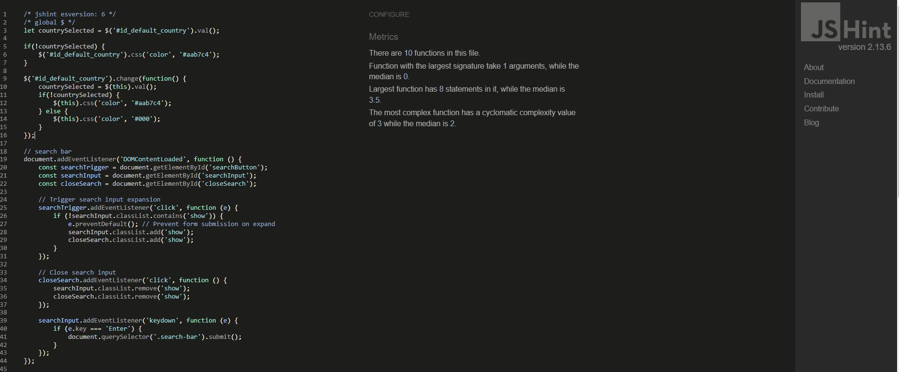
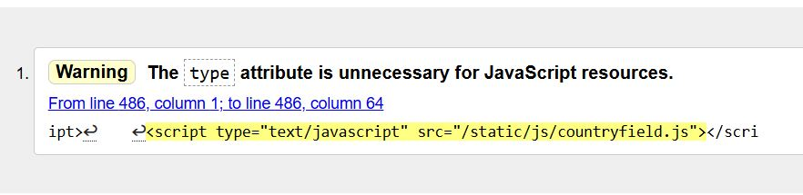

# Testing

This is the TESTING file for the [Mindspark](https://mind-spark-139c9f977593.herokuapp.com/) website.

Return back to the [README.md](README.md) file.

## Testing Contents  
  
- [Testing](#testing)
  - [Manual Testing](#manual-testing)
  - [Validator Testing](#validator-testing)
    - [Lighthouse](#lighthouse)
    - [HTML](#html)
    - [CSS](#css)
    - [JavaScript](#javascript)
    - [Automated Testing](#automated-testing)
    - [Python](#python)
    - [Browser Compatibility](#browser-compatibility)
    - [Testing User Stories](#testing-user-stories)
  - [Bugs](#bugs)
    - [Unfixed Bugs](#unfixed-bugs)

### Manual Testing

Testing

 

- Mindspark website is tested and verified with no issues in different browsers:
  
  - [Google Chrome](https://www.google.com/intl/en_in/chrome/)
  - [Mozilla Firefox](https://www.mozilla.org/en-US/firefox/)
  - [Microsoft Edge](https://www.microsoft.com/en-us/edge/welcome?form=MA13FJ)

- Mindspark webpage is tested and verified that my website is responsive in various screen devices by using Google chrome web developer tools
  
  - Laptop
  - Tablet
  - Large screen mobile
  - Desktop

### Validator Testing

All pages passed through the Lighthouse test

- [Lighthouse test for all Apps in Mobile](read-me/testing-validators/lighthouse-mobile/1.JPG)
- [Lighthouse test for all Apps in Mobile](read-me/testing-validators/lighthouse-mobile/2.JPG)
- [Lighthouse test for all Apps in Mobile](read-me/testing-validators/lighthouse-mobile/3.JPG)
- [Lighthouse test for all Apps in Mobile](read-me/testing-validators/lighthouse-mobile/4.JPG)
- [Lighthouse test for all Apps in Mobile](read-me/testing-validators/lighthouse-mobile/5.JPG)
- [Lighthouse test for all Apps in Mobile](read-me/testing-validators/lighthouse-mobile/6.JPG)
- [Lighthouse test for all Apps in Mobile](read-me/testing-validators/lighthouse-mobile/7.JPG)
- [Lighthouse test for all Apps in Mobile](read-me/testing-validators/lighthouse-mobile/8.JPG)
- [Lighthouse test for all Apps in Mobile](read-me/testing-validators/lighthouse-mobile/9.JPG)
- [Lighthouse test for all Apps in Mobile](read-me/testing-validators/lighthouse-mobile/10.JPG)
- [Lighthouse test for all Apps in Mobile](read-me/testing-validators/lighthouse-mobile/11.JPG)
- [Lighthouse test for all Apps in Mobile](read-me/testing-validators/lighthouse-mobile/12.JPG)
- [Lighthouse test for all Apps in Mobile](read-me/testing-validators/lighthouse-mobile/13.JPG)
- [Lighthouse test for all Apps in Mobile](read-me/testing-validators/lighthouse-mobile/14.JPG)
- [Lighthouse test for all Apps in Mobile](read-me/testing-validators/lighthouse-mobile/15.JPG)
- [Lighthouse test for all Apps in Mobile](read-me/testing-validators/lighthouse-mobile/16.JPG)
- [Lighthouse test for all Apps in Mobile](read-me/testing-validators/lighthouse-mobile/17.JPG)
- [Lighthouse test for all Apps in Mobile](read-me/testing-validators/lighthouse-mobile/18.JPG)

- [Lighthouse test for all Apps in Desktop](read-me/testing-validators/lighthouse-desktop/1.JPG)
- [Lighthouse test for all Apps in Desktop](read-me/testing-validators/lighthouse-desktop/2.JPG)
- [Lighthouse test for all Apps in Desktop](read-me/testing-validators/lighthouse-desktop/3.JPG)
- [Lighthouse test for all Apps in Desktop](read-me/testing-validators/lighthouse-desktop/4.JPG)
- [Lighthouse test for all Apps in Desktop](read-me/testing-validators/lighthouse-desktop/5.JPG)
- [Lighthouse test for all Apps in Desktop](read-me/testing-validators/lighthouse-desktop/6.JPG)
- [Lighthouse test for all Apps in Desktop](read-me/testing-validators/lighthouse-desktop/7.JPG)
- [Lighthouse test for all Apps in Desktop](read-me/testing-validators/lighthouse-desktop/8.JPG)
- [Lighthouse test for all Apps in Desktop](read-me/testing-validators/lighthouse-desktop/9.JPG)
- [Lighthouse test for all Apps in Desktop](read-me/testing-validators/lighthouse-desktop/10.JPG)
- [Lighthouse test for all Apps in Desktop](read-me/testing-validators/lighthouse-desktop/11.JPG)
- [Lighthouse test for all Apps in Desktop](read-me/testing-validators/lighthouse-desktop/12.JPG)
- [Lighthouse test for all Apps in Desktop](read-me/testing-validators/lighthouse-desktop/13.JPG)
- [Lighthouse test for all Apps in Desktop](read-me/testing-validators/lighthouse-desktop/14.JPG)
- [Lighthouse test for all Apps in Desktop](read-me/testing-validators/lighthouse-desktop/15.JPG)
- [Lighthouse test for all Apps in Desktop](read-me/testing-validators/lighthouse-desktop/16.JPG)

### HTML

All pages have passed through the [W3 Markup HTML Validator](https://validator.w3.org/). I navigated to each page of the deployed site and used the "View Page Source" option to access the HTML code, and validated it in the W3C Markup HTML Validator.

### CSS

CSS stylesheet have passed through the [W3 CSS Validator](https://jigsaw.w3.org/css-validator/)

### JS Hint

JSHint was used to look for errors in js files. No warnings found.

  

### Automated Testing

tests.py resulted no issues for my wishlist app and contact app.

### Python

[CI Python Linter](https://pep8ci.herokuapp.com/#) was used to validate the Python files. Couldn't able to adjust the long characters. I have included some screenshots with the results below.

| Features     	| Models.py                                                   	| Forms.py                                                    	| Admin.py                                                    	| Tests.py                                                 	| Views.py                                                    	| Urls.py                                                     	| Widgets.py                                           	| Contexts.py                                          	| Signals.py                                               	| webhook_handler.py                                       	| webhooks.py                                              	|
|--------------	|-------------------------------------------------------------	|-------------------------------------------------------------	|-------------------------------------------------------------	|----------------------------------------------------------	|-------------------------------------------------------------	|-------------------------------------------------------------	|------------------------------------------------------	|------------------------------------------------------	|----------------------------------------------------------	|----------------------------------------------------------	|----------------------------------------------------------	|
| Home         	| N/A                                                         	| N/A                                                         	| N/A                                                         	| N/A                                                      	|          	|          	| N/A                                                  	| N/A                                                  	| N/A                                                      	| N/A                                                      	| N/A                                                      	|
| Blog         	|          	|          	|          	| N/A                                                      	|          	|          	| N/A                                                  	| N/A                                                  	| N/A                                                      	| N/A                                                      	| N/A                                                      	|
| Shop         	|          	|          	|         	| N/A                                                      	|         	|         	|  	| N/A                                                  	| N/A                                                      	| N/A                                                      	| N/A                                                      	|
| Profiles     	|     	|     	|     	| N/A                                                      	|     	|     	| N/A                                                  	| N/A                                                  	| N/A                                                      	| N/A                                                      	| N/A                                                      	|
| Wishlist     	|     	| N/A                                                         	|     	|  	|     	|     	| N/A                                                  	| N/A                                                  	| N/A                                                      	| N/A                                                      	| N/A                                                      	|
| Cart         	| N/A                                                         	| N/A                                                         	| N/A                                                         	| N/A                                                      	|         	|         	| N/A                                                  	|  	| N/A                                                      	| N/A                                                      	| N/A                                                      	|
| Checkout     	|     	|     	|     	| N/A                                                      	|     	|     	| N/A                                                  	| N/A                                                  	|  	|  	|  	|
| Contact      	|      	|      	|      	|   	|      	|      	| N/A                                                  	| N/A                                                  	| N/A                                                      	| N/A                                                      	| N/A                                                      	|
| Testimonials 	|  	|  	|  	| N/A                                                      	|  	|  	| N/A                                                  	| N/A                                                  	| N/A                                                      	| N/A                                                      	| N/A                                                      	|

### Testing User Stories

User Stories are documented in the Mindspark [GitHub Projects Board](https://github.com/users/klsoundarya/projects/5). User Stories are numbered, with Acceptance Criteria and Tasks detailed within. All features were tested to ensure that they provided the user with the expected output and action.

| User Story                    	| Acceptance Criteria Met? 	| Pass/Fail 	|
|-------------------------------	|--------------------------	|-----------	|
| Home                          	| Yes                      	| Pass      	|
| Navigation                    	| Yes                      	| Pass      	|
| Footer                        	| yes                      	| Pass      	|
| Register Page                 	| Yes                      	| Pass      	|
| Login Page                    	| Yes                      	| Pass      	|
| Logout Page                   	| Yes                      	| Pass      	|
|Shop Page               	| Yes                      	| Pass      	|
| Product-detail Posts               	| Yes                      	| Pass      	|
| Update Password               	| Yes                      	| Pass      	|
| Contact Page                  	| Yes                      	| Pass      	|
| Blog Page                    	| Yes                      	| Pass      	|
| Newsletter subscription                   	| Yes                      	| Pass      	|
| My profile              	| Yes                      	| Pass      	|
| Add a product          	| Yes                      	| Pass      	|
| Wishlist     	| Yes                      	| Pass      	|
| Cart   	| Yes                      	| Pass      	|
| Checkout          	| Yes                      	| Pass      	|
| Thank you checkout 	| Yes                      	| Pass      	|
| Delete Account                      	| Yes                      	| Pass      	|
| Add clear button            	| Yes                      	| Pass       	|
| Add edit/update button for blog           	| Yes                      	| Pass       	|
| Add edit/update button for product          	| Yes                      	| Pass       	|
| Add edit/delete button for testimonial review          	| Yes                      	| Pass       	|

### Bugs

Bugs Fixed

 

| No. 	| Bugs                                            	| Notes 	|
|-----	|-------------------------------------------------	|-------	|
| 1.  	|      	| Fixed 	|
| 2.  	|      	| Fixed 	|
| 3.  	|      	| Fixed 	|
| 4.  	|      	| Fixed 	|
| 5.  	|      	| Fixed 	|
| 6.  	|      	| Fixed 	|
| 7. 	  |  	  | Fixed 	|
| 8. 	  |  	          | Fixed 	|
| 9. 	  |  	          | Fixed 	|
| 10. 	  |  	          | Fixed 	|
| 11. 	  |  	          | Fixed 	|
| 12. 	  |  	          | Fixed 	|
| 13. 	  |  	          | Fixed 	|

### Unfixed Bugs

There are no other known bugs to be fixed.

