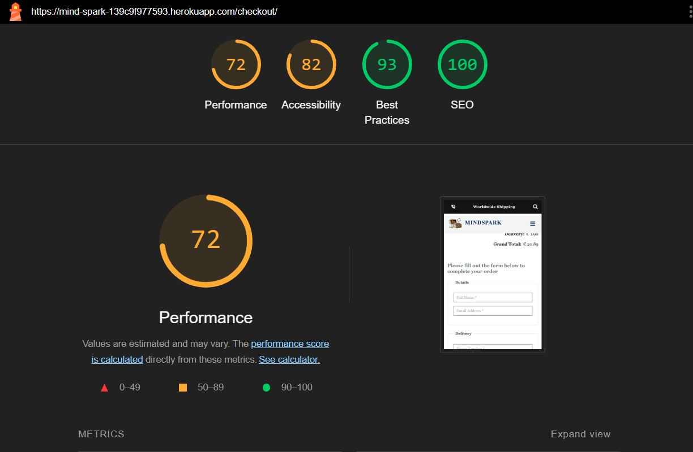
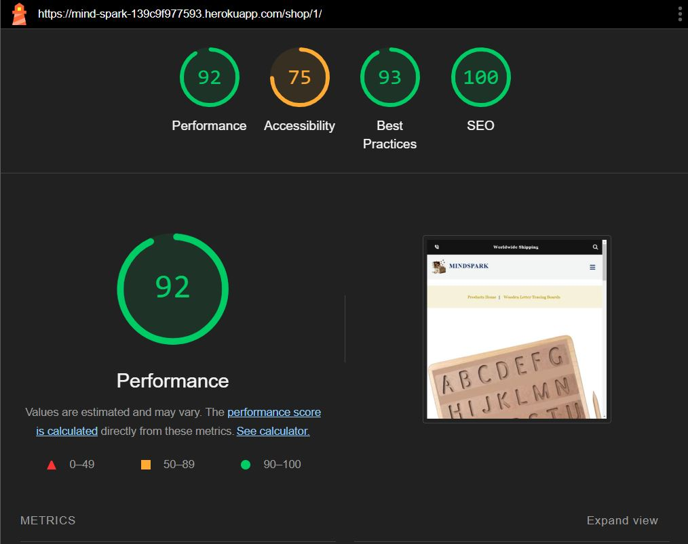
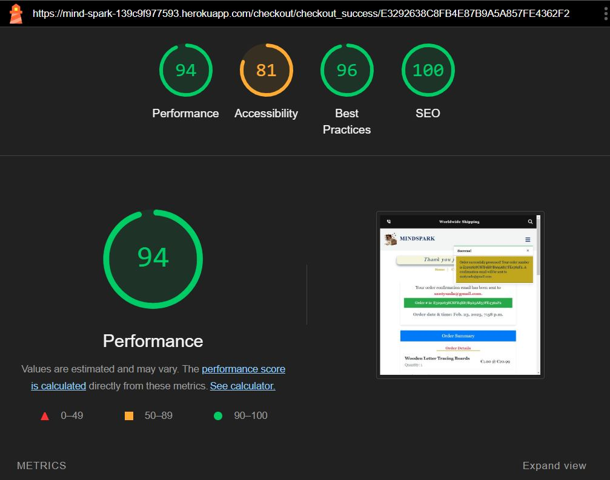
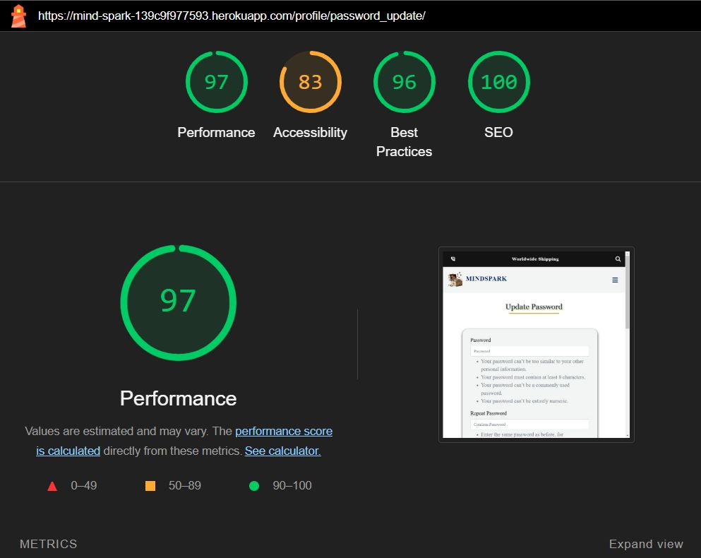
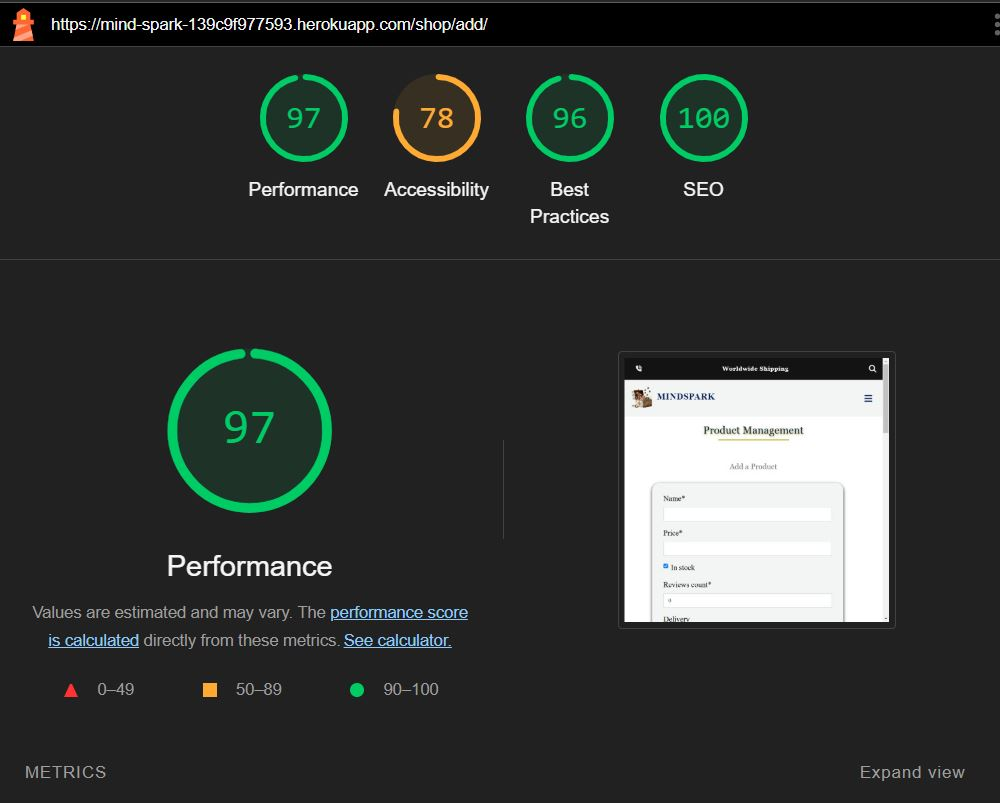
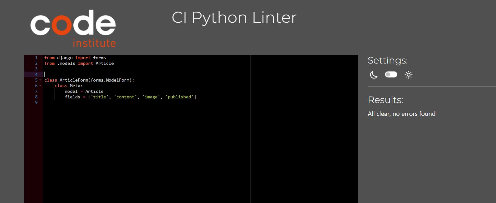
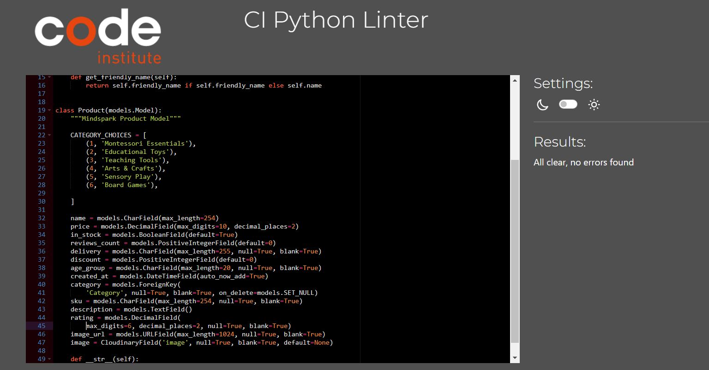
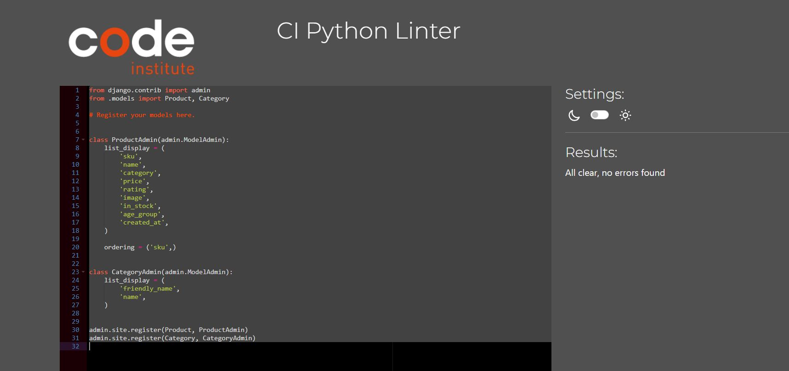
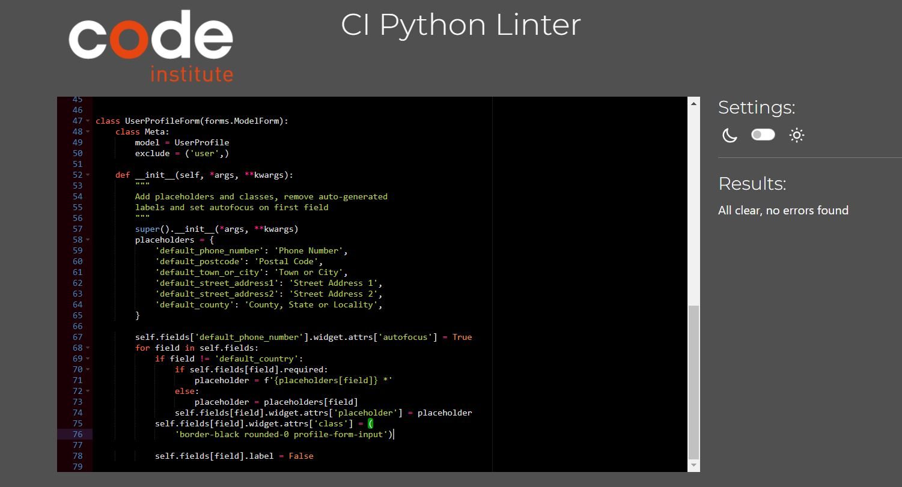
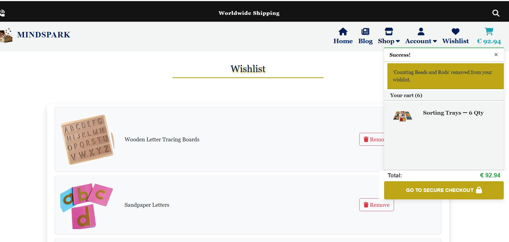

# Testing

This is the TESTING file for the [Mindspark](https://mind-spark-139c9f977593.herokuapp.com/) website.

Return back to the [README.md](README.md) file.

## Testing Contents  
  
- [Testing](#testing)
  - [Manual Testing](#manual-testing)
  - [Validator Testing](#validator-testing)
    - [Lighthouse](#lighthouse)
    - [HTML](#html)
    - [CSS](#css)
    - [JavaScript](#javascript)
    - [Automated Testing](#automated-testing)
    - [Python](#python)
    - [Browser Compatibility](#browser-compatibility)
    - [Testing User Stories](#testing-user-stories)
  - [Bugs](#bugs)
    - [Unfixed Bugs](#unfixed-bugs)

### Manual Testing

Testing

 
 

| **Page Name**       | **Action**                                           | **Expected Behavior**                                               | **Pass/Fail** | **Tested** |
|---------------------|------------------------------------------------------|----------------------------------------------------------------------|--------------|------------|
| **Base**           | Click on the contact icon                            | Redirects to the contact page                                       | ✅ Pass      | Yes        |
| **Base**           | Use the search bar                                   | Allows users to search for content successfully                      | ✅ Pass      | Yes        |
| **Base**           | Click on navigation links                            | Navigates to the respective pages                                    | ✅ Pass      | Yes        |
| **Base**           | Click on the website logo                           | Redirects to the home page                                           | ✅ Pass      | Yes        |
| **Base**           | Open on smaller screens                              | Displays a responsive hamburger menu                                | ✅ Pass      | Yes        |
| **Base**           | Check for favicon                                    | Favicon is properly displayed                                       | ✅ Pass      | Yes        |
| **Home**           | View the homepage carousel                          | Three sliding images transition smoothly                            | ✅ Pass      | Yes        |
| **Home**           | View the About section                              | Displays images and a "Shop" button linking to the shop page        | ✅ Pass      | Yes        |
| **Home**           | View Latest Blogs section                           | Blog content is displayed with a "Read Blog" button                 | ✅ Pass      | Yes        |
| **Home**           | Click "Read Blog" button                            | Navigates to the respective blog page                               | ✅ Pass      | Yes        |
| **Home**           | Submit a testimonial                               | Redirects to login page if user is unauthenticated                  | ✅ Pass      | Yes        |
| **Home**           | Submit a testimonial (authenticated user)           | User can leave a review through a form                              | ✅ Pass      | Yes        |
| **Home**           | Edit or delete own testimonial                      | Users can modify or remove their own reviews                        | ✅ Pass      | Yes        |
| **Home**           | View testimonials                                   | All users (authenticated & unauthenticated) can see reviews         | ✅ Pass      | Yes        |
| **Footer (Base)**  | Click on social media links                         | Redirects to respective social media platforms                      | ✅ Pass      | Yes        |
| **Footer (Base)**  | Click on Privacy Policy link                        | Navigates to the Privacy Policy page                                | ✅ Pass      | Yes        |
| **Footer (Base)**  | Check for free delivery message                     | "Free Delivery on Orders Above €50" message is visible             | ✅ Pass      | Yes        |
| **Blog Page**      | Admin adds new blog post                            | UI allows adding a blog post with title, content, and image         | ✅ Pass      | Yes        |
| **Blog Page**      | Admin saves blog post as draft                      | Blog remains hidden from public view                                | ✅ Pass      | Yes        |
| **Blog Page**      | Admin publishes blog post                           | Blog becomes visible to all users                                   | ✅ Pass      | Yes        |
| **Blog Page**      | Admin edits a blog post                             | UI allows editing the title, content, and image                     | ✅ Pass      | Yes        |
| **Blog Page**      | Admin deletes a blog post                           | Blog is removed from the system                                    | ✅ Pass      | Yes        |
| **Blog Page**      | Click "Cancel" while editing                        | Redirects to blog list without saving changes                      | ✅ Pass      | Yes        |
| **Blog Page**      | View blog posts                                     | Only published blog posts are visible to all users                  | ✅ Pass      | Yes        |
| **Shop Page**      | View all products                                   | Displays all available products with images, name, and price       | ✅ Pass      | Yes        |
| **Shop Page**      | Click on a product                                 | Redirects to the product detail page                               | ✅ Pass      | Yes        |
| **Product Detail** | View product details                               | Displays product image, description, price, and "Add to Cart" button | ✅ Pass  | Yes        |
| **Product Detail** | Click "Add to Cart"                                | Product is added to the cart                                       | ✅ Pass      | Yes        |
| **Product Detail** | View related products                              | Displays other recommended products                                | ✅ Pass      | Yes        |
| **Login Page**     | Enter valid credentials and submit                 | User is logged in successfully                                    | ✅ Pass      | Yes        |
| **Login Page**     | Enter invalid credentials                          | Error message is displayed                                       | ✅ Pass      | Yes        |
| **Logout**        | Click logout button                                 | User is logged out and redirected to the home page               | ✅ Pass      | Yes        |
| **Signup Page**   | Enter valid details and submit                      | User is registered successfully and logged in                     | ✅ Pass      | Yes        |
| **Signup Page**   | Enter invalid/missing details                       | Error messages are displayed                                     | ✅ Pass      | Yes        |
| **FAQs Page**     | View FAQs section                                   | All questions and answers are displayed                          | ✅ Pass      | Yes        |
| **Profile Page**  | View profile details                               | Displays user details with an option to edit                     | ✅ Pass      | Yes        |
| **Profile Page**  | Update profile information                          | Changes are saved successfully                                   | ✅ Pass      | Yes        |
| **Update Password** | Change password successfully                     | User can log in with a new password                             | ✅ Pass      | Yes        |
| **Delete Account** | Click "Delete Account" and confirm                 | Account is permanently removed                                 | ✅ Pass      | Yes        |
| **Wishlist Page** | Click "Add to Wishlist" (Unauthenticated user)      | Redirects to login page                                        | ✅ Pass      | Yes        |
| **Wishlist Page** | Click "Add to Wishlist" (Authenticated user)        | Product is saved to the wishlist                               | ✅ Pass      | Yes        |
| **Wishlist Page** | View wishlist                                      | Displays saved products                                       | ✅ Pass      | Yes        |
| **Wishlist Page** | Remove product from wishlist                       | Product is removed successfully                               | ✅ Pass      | Yes        |
| **Cart Page**     | View cart                                          | Displays all added products with quantity and total price     | ✅ Pass      | Yes        |
| **Cart Page**     | Update product quantity                            | Price updates accordingly                                    | ✅ Pass      | Yes        |
| **Cart Page**     | Remove product from cart                           | Product is removed successfully                             | ✅ Pass      | Yes        |
| **Checkout Page** | Click "Proceed to Checkout"                       | Redirects to checkout page                                  | ✅ Pass      | Yes        |
| **Checkout Page** | Enter shipping details and complete order          | Order is placed successfully                                | ✅ Pass      | Yes        |
| **Checkout Page** | Enter incorrect details                            | Error messages are displayed                               | ✅ Pass      | Yes        |
| **Thank You Page** | View order confirmation message                   | Displays order details and "Continue Shopping" button      | ✅ Pass      | Yes        |

- Mindspark website is tested and verified with no issues in different browsers:
  
  - [Google Chrome](https://www.google.com/intl/en_in/chrome/)
  - [Mozilla Firefox](https://www.mozilla.org/en-US/firefox/)
  - [Microsoft Edge](https://www.microsoft.com/en-us/edge/welcome?form=MA13FJ)

- Mindspark webpage is tested and verified that my website is responsive in various screen devices by using Google chrome web developer tools
  
  - Laptop
  - Tablet
  - Large screen mobile
  - Desktop

### Validator Testing

### Lighthouse

All pages passed through the Lighthouse test. The performance score is lower due to image aspect ratios, the absence of WebP images, and the use of Stripe and jQuery CDN. I will analyze these factors in future versions to identify improvements and enhance performance.

### HTML

All pages have passed through the [W3 Markup HTML Validator](https://validator.w3.org/). I navigated to each page of the deployed site and used the "View Page Source" option to access the HTML code, and validated it in the W3C Markup HTML Validator.

### CSS

CSS stylesheet have passed through the [W3 CSS Validator](https://jigsaw.w3.org/css-validator/)

### JS Hint

JSHint was used to look for errors in js files. No warnings found.

  

### Automated Testing

tests.py resulted no issues for my wishlist app and contact app.

### Python

[CI Python Linter](https://pep8ci.herokuapp.com/#) was used to validate the Python files. Couldn't able to adjust the long characters. I have included some screenshots with the results below.

| Features     	| Models.py                                                   	| Forms.py                                                    	| Admin.py                                                    	| Tests.py                                                 	| Views.py                                                    	| Urls.py                                                     	| Widgets.py                                           	| Contexts.py                                          	| Signals.py                                               	| webhook_handler.py                                       	| webhooks.py                                              	|
|--------------	|-------------------------------------------------------------	|-------------------------------------------------------------	|-------------------------------------------------------------	|----------------------------------------------------------	|-------------------------------------------------------------	|-------------------------------------------------------------	|------------------------------------------------------	|------------------------------------------------------	|----------------------------------------------------------	|----------------------------------------------------------	|----------------------------------------------------------	|
| Home         	| N/A                                                         	| N/A                                                         	| N/A                                                         	| N/A                                                      	|          	|          	| N/A                                                  	| N/A                                                  	| N/A                                                      	| N/A                                                      	| N/A                                                      	|
| Blog         	|          	|          	|          	| N/A                                                      	|          	|          	| N/A                                                  	| N/A                                                  	| N/A                                                      	| N/A                                                      	| N/A                                                      	|
| Shop         	|          	|          	|         	| N/A                                                      	|         	|         	|  	| N/A                                                  	| N/A                                                      	| N/A                                                      	| N/A                                                      	|
| Profiles     	|     	|     	|     	| N/A                                                      	|     	|     	| N/A                                                  	| N/A                                                  	| N/A                                                      	| N/A                                                      	| N/A                                                      	|
| Wishlist     	|     	| N/A                                                         	|     	|  	|     	|     	| N/A                                                  	| N/A                                                  	| N/A                                                      	| N/A                                                      	| N/A                                                      	|
| Cart         	| N/A                                                         	| N/A                                                         	| N/A                                                         	| N/A                                                      	|         	|         	| N/A                                                  	|  	| N/A                                                      	| N/A                                                      	| N/A                                                      	|
| Checkout     	|     	|     	|     	| N/A                                                      	|     	|     	| N/A                                                  	| N/A                                                  	|  	|  	|  	|
| Contact      	|      	|      	|      	|   	|      	|      	| N/A                                                  	| N/A                                                  	| N/A                                                      	| N/A                                                      	| N/A                                                      	|
| Testimonials 	|  	|  	|  	| N/A                                                      	|  	|  	| N/A                                                  	| N/A                                                  	| N/A                                                      	| N/A                                                      	| N/A                                                      	|

### Testing User Stories

User Stories are documented in the Mindspark [GitHub Projects Board](https://github.com/users/klsoundarya/projects/5). User Stories are numbered, with Acceptance Criteria and Tasks detailed within. All features were tested to ensure that they provided the user with the expected output and action.

| User Story                    	| Acceptance Criteria Met? 	| Pass/Fail 	|
|-------------------------------	|--------------------------	|-----------	|
| Home                          	| Yes                      	| Pass      	|
| Navigation                    	| Yes                      	| Pass      	|
| Footer                        	| yes                      	| Pass      	|
| Register Page                 	| Yes                      	| Pass      	|
| Login Page                    	| Yes                      	| Pass      	|
| Logout Page                   	| Yes                      	| Pass      	|
|Shop Page               	| Yes                      	| Pass      	|
| Product-detail Posts               	| Yes                      	| Pass      	|
| Update Password               	| Yes                      	| Pass      	|
| Contact Page                  	| Yes                      	| Pass      	|
| Blog Page                    	| Yes                      	| Pass      	|
| Newsletter subscription                   	| Yes                      	| Pass      	|
| My profile              	| Yes                      	| Pass      	|
| Add a product          	| Yes                      	| Pass      	|
| Wishlist     	| Yes                      	| Pass      	|
| Cart   	| Yes                      	| Pass      	|
| Checkout          	| Yes                      	| Pass      	|
| Thank you checkout 	| Yes                      	| Pass      	|
| Delete Account                      	| Yes                      	| Pass      	|
| Add clear button            	| Yes                      	| Pass       	|
| Add edit/update button for blog           	| Yes                      	| Pass       	|
| Add edit/update button for product          	| Yes                      	| Pass       	|
| Add edit/delete button for testimonial review          	| Yes                      	| Pass       	|

### Bugs

Bugs Fixed

 

- When a user submits a form on the contact details page, if they use the erase functionality (e.g., clearing or editing the form) and attempt to fill in the details and resubmit, a 403 Forbidden CSRF token error occurs. However, if the page is refreshed before submitting the form, the submission works as expected.

- Emails not sent for user signup, order checkout, or forgot password when using an incognito tab.

- If any issues occur during checkout, a 500 Internal Server Error is displayed.
 

| No. 	| Bugs                                            	| Notes 	|
|-----	|-------------------------------------------------	|-------	|
| 1.  	|      	| Fixed 	|
| 2.  	|      	| Fixed 	|
| 3.  	|      	| Fixed 	|
| 4.  	|      	| Fixed 	|
| 5.  	|      	| Fixed 	|
| 6.  	|      	| Fixed 	|
| 7. 	  |  	  | Fixed 	|
| 8. 	  |  	          | Fixed 	|
| 9. 	  |  	          | Fixed 	|
| 10. 	  |  	          | Fixed 	|
| 11. 	  |  	          | Fixed 	|
| 12. 	  |  	          | Fixed 	|
| 13. 	  |  	          | Fixed 	|

### Unfixed Bugs

- On the checkout success page, the dropdowns for "Shop" and "Account" do not transition smoothly.

- When removing products from the wishlist, the alert message bar also displays the cart update notification. I'll address this issue later.

 

